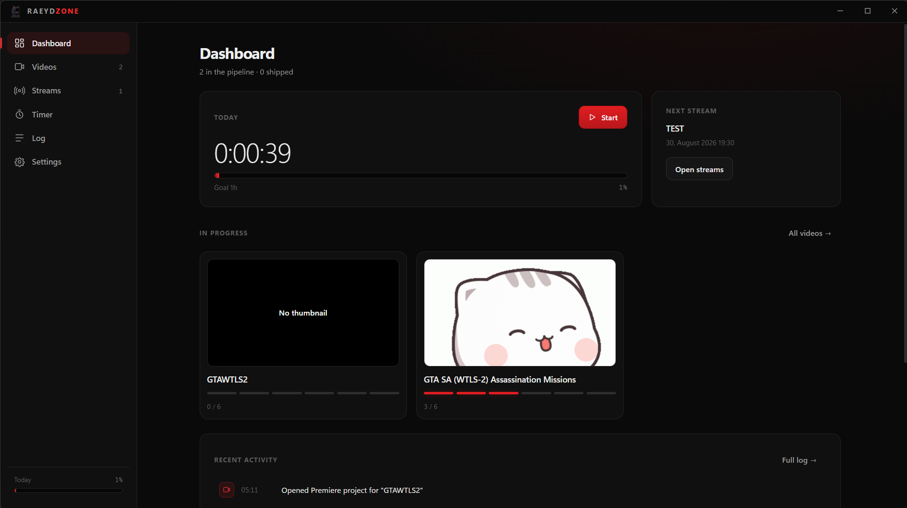
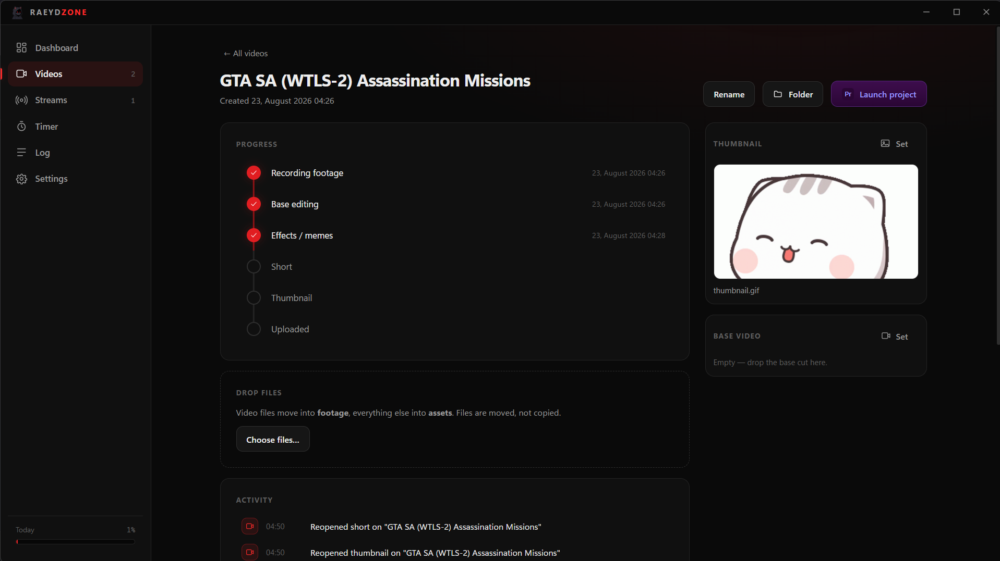
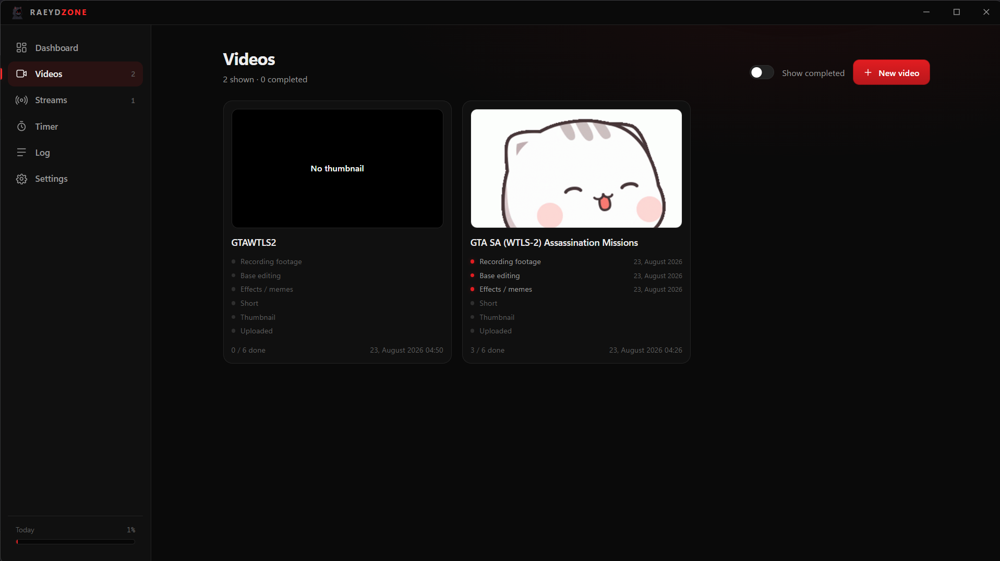
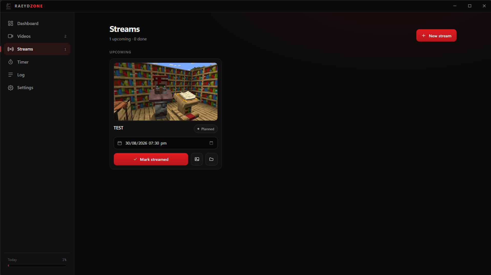
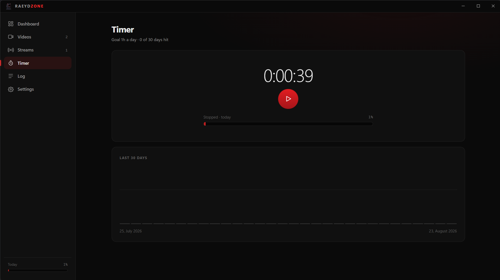
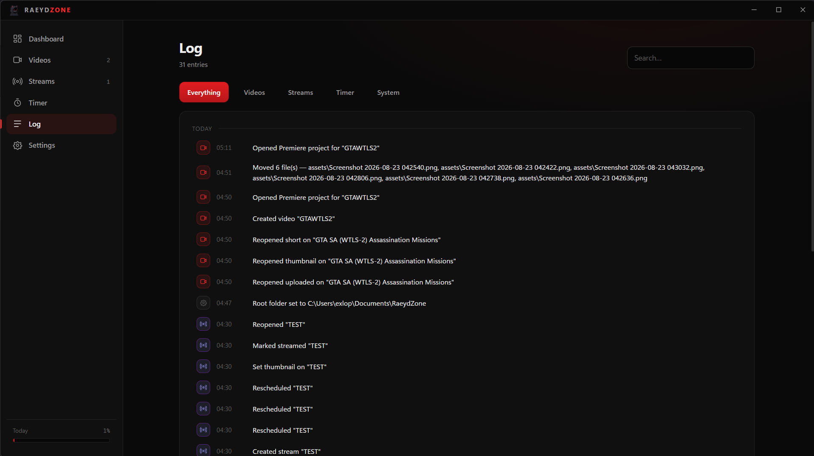
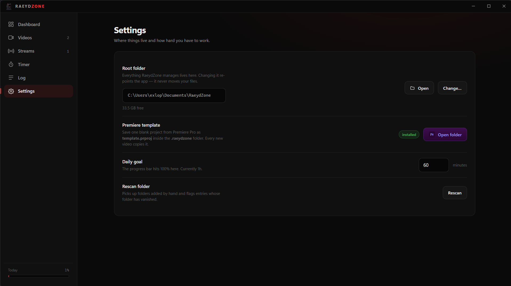

<div align="center">


# RaeydZone

**A desktop production tracker for YouTube creators.**

Manages your project folders, tracks every video through an editing pipeline,
and holds you to a daily work goal.


<br>



</div>

---

## The problem

Making videos on a schedule generates mess faster than it generates videos. Footage piles
up in Downloads. Half-finished projects lose their thumbnails. You forget whether the
short was cut or whether last Tuesday's upload actually went out. And the days you didn't
work leave no trace, so the drift is invisible until the channel stalls.

RaeydZone is the layer that keeps that straight. It is not a video editor and not an
uploader — it manages **folders, progress, and time**.

## Features

### Video pipeline

Every video moves through six stages. They display in order but complete in any order,
because the thumbnail often lands before the effects do. Each stage stores its own
completion timestamp, and unchecking one records the reversal.

<div align="center">

</div>

### Projects own their folders

Creating a video creates its folder, its subfolders, and a Premiere project copied from
your own blank template — named to match, ready to open with one button.

<div align="center">

</div>

### Drop files where they belong

Drag anything onto a project. Video files move into `footage/`, everything else into
`assets/`. Files are **moved, not copied**, so nothing is left behind to clean up later.
Thumbnails and the base cut have their own single-occupancy slots that replace on drop.

### Streams

Lighter than videos: a name, a thumbnail, a scheduled time that fires a desktop
notification, and a streamed / not-yet flag. Missed reminders surface on next launch
rather than vanishing.

<div align="center">

</div>

### Daily work timer

Start and stop as often as you like — the day accumulates. The bar fills at one hour.
Sessions that cross midnight are split at the boundary so each day gets its real minutes,
and a heartbeat every 30 seconds means a crash costs you at most half a minute rather
than the whole session.

<div align="center">

</div>

### Everything is logged

Every state change — created, renamed, checked, unchecked, moved, scheduled, streamed —
lands in a searchable log grouped by day, with the same activity feed scoped to each
project.

<div align="center">

</div>

## Installing

Download the latest `RaeydZone Setup <version>.exe` from
[**Releases**](https://github.com/raeydzone/raeydzone-app/releases) and run it.

The app checks for updates on launch and every six hours. When a new version has
downloaded, an **Update** button appears above the daily progress bar; clicking it
restarts into the new version.

**Requirements**

| | |
|---|---|
| OS | Windows 11 (Windows 10 should work; untested) |
| Disk | ~200 MB for the app, plus whatever your footage needs |
| Premiere Pro | Optional — only needed for project templating and launch |

## First run

RaeydZone asks for one folder to manage. It proposes `~/Documents/RaeydZone`, and you can
point it anywhere outside a cloud-sync tree.

<div align="center">

</div>

```
RaeydZone/
├── .raeydzone/
│   ├── raeydzone.db        SQLite — projects, log, timer history
│   └── template.prproj     your blank Premiere project
├── Videos/
│   └── <Video Name>/
│       ├── <Video Name>.prproj
│       ├── raw_base_video.mp4
│       ├── thumbnail.png
│       ├── footage/
│       └── assets/
└── Streams/
    └── <Stream Name>/
        └── thumbnail.png
```

The database lives inside the managed folder, so moving or backing up that folder moves
everything as one unit. **Rescan** in Settings reconciles the database against what is
actually on disk — it adopts folders you created by hand and flags entries whose folder
has disappeared.

### Premiere Pro templating

Save one blank project from Premiere as `.raeydzone/template.prproj`. Every new video
copies it, so projects are always created at your Premiere version with your own
sequence presets. The app never writes into `.prproj` files — that format is gzipped XML
with internal identifiers, and editing it externally risks projects that will not open.

## Building from source

```bash
npm install
npm run dev
```

```bash
npm run build
```

The installer lands in `dist/`.

> **Windows Developer Mode must be enabled** to package (Settings → System → For
> developers). Without it, electron-builder cannot extract its code-signing cache, which
> contains macOS symlinks that Windows refuses to create otherwise. The failure reads
> `Cannot create symbolic link ... libcrypto.dylib`.

## Architecture

```
src/
├── main/          Electron main — filesystem, SQLite, IPC, updater
│   ├── services/  db · library · timer · log · premiere · settings · updater
│   └── util/      path sanitising, safe joins, cross-device moves
├── preload/       the only bridge; contextIsolation on, nodeIntegration off
├── renderer/      React 19 — pages, components, CSS modules
└── shared/        types and formatters used by both sides
```

Design decisions worth knowing:

- **All filesystem work happens in main.** Every path is validated to sit inside the
  managed root before anything is written, moved, or deleted.
- **Moves are real moves.** `fs.rename`, falling back to copy-and-unlink only across
  devices; a failed move leaves the source untouched.
- **No native modules.** Storage uses `node:sqlite`, built into the Node 22 runtime that
  Electron 35 ships, so there is nothing to compile and no ABI to match.
- **Media is served over a custom protocol** scoped to the managed root, rather than
  loosening web security to read local files.

## Versioning

`0.MAJOR.PATCH`

- Bug fixes and small changes bump the patch — `0.1.1`, `0.1.2`, …
- Larger feature work bumps the middle number and resets to `.1` — `0.2.1`, `0.3.1`, …

Releasing:

```bash
npx electron-builder --win --publish always
```

with `GH_TOKEN` set to a token that can write releases.

## Conventions

- Comments are capped at **5% of lines** and explain *why*, never *what*
- Timestamps always render as `DD, Month YYYY HH:MM` — `23, August 2026 14:30`
- No hardcoded user paths; the managed root resolves from `app.getPath('home')`
- OneDrive folders are rejected as roots — large footage does not belong in a sync engine
- Every colour, spacing step, radius, and duration is a CSS custom property in one theme
  file; a raw hex in a component is a bug

## License

MIT — see [LICENSE](LICENSE).
